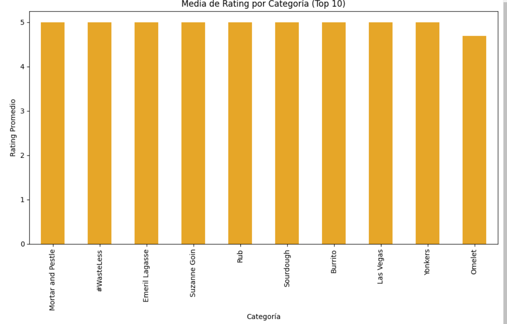
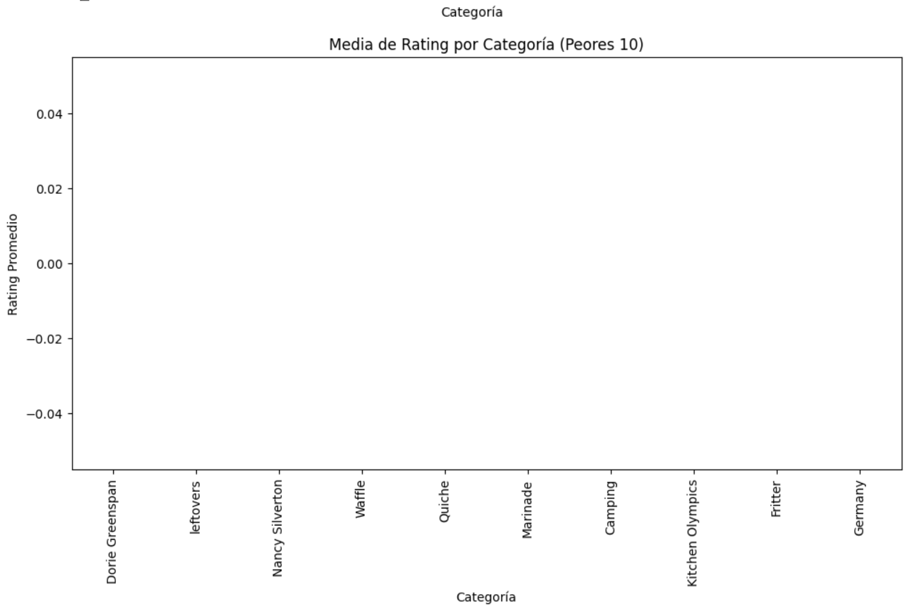

# Proyecto-final-TD
En este proyecto se realizará una tarea de regresión mediante las vectorizaciones que se hallen a traveés de las variables de entrada como 'categories' o 'directions' y la variable 'rating' será la variable de salida. Se realizarán diversos analisis de dichas variables, procesado de textos, representación vectorial, entrenamiento y evaluación, hugging face y por último una pequeña extensión que realizará resúmenes y generación de unas recetas mediante un texto proporcionado.
## 1. Análisis de la variable rating y categories
En este apartado se realizará un análisis de ambas variables y se tratarán de averiguar problemas o deducir correlaciones entre determinadas categorías y la variable de salida rating. La variable rating representa la puntuación de la receta por lo que es un buen parámetro para determinar si es una buena o mala receta. Primero se realizará una representación de la distribución del rating.

  

De esta primera gráfica se puede observar que la mayoría de ratings son muy positivos (entre 4-5) y que la mayoría se encuentran entre 4 y 5 indicando que o la mayoría de recetas son de muy buena calidad o que los usuarios suelen dar muy buena puntuación al calificar las recetas. A continuación se procede a representar el rating promedio por cada categoría y las categorías que aparecen con mayor frecuencia.

  

En la primera gráfica se confirma lo visto anteriormente ya que la mayoría de recetas se encuentran en torno al 4. La segunda gráfica puede proporcionar información de porque algunas categorías son más famosas que otras:
- Alergias o intolerancias: Se pueden observar que en la posición 2, 3, 4 y 9 aparecen categorías relacionadas con intolerancias (cacahuete, frutos secos , soja y gluten), esta popularidad se puede deber a que muchas personas necesitan recetas sin determinados alimentos por su salud.
- Religiosidad: También determinadas categorías son populares debido a las prácticas religiosas, en concreto 'kosher' significa que esos alimentos respetan la ley judía.
- Facilidad y rapidez: Hoy en día un aspecto muy importante es la rapidez a la hora de hacer la comida por ello la categoría 'quick & easy' está tan alta.
- Dietas especiales: Aparecen categorías como comida vegetariana o pescatariana (vegetariana con pescado), esto puede determinar una aumento en la popularidad de dichas dietas.
En resumen estas categorías destacan por tendencias como la salud, rapidez o culturales.

Para poder ver una relación más concreta o una correlación entre la variable de salida y la entrada se utilizarán las categorías con mejor y peor rating, para ello se utilizan una serie de gráficos que nos permiten visualizar la salida respecto de la entrada, primero se medirán cuales son las recetas con mejor y peor rating, en concreto las 10 mejores y las 10 peores recetas. 

  

Al representar esto tampoco se obtiene mucha información ya que no se puede observar alguna correlación, esto se puede deber a que no es representativo su valor ya que puede ser que solo tenga una reseña y por ello destaque o sea tan insignificate dicha categoría. Para solucionar este problema se realizará un análisis de las mejores y peores categorías con al menos 30 reseñas, gracias a esto se puede realizar un análisis más completo.

  

En este gráfico se puede observar una correlación directa entre el rating y las categorías.Destaca que hay muchas categorías relacionadas con carne, esto puede significar que una receta que influya carne suele tener mayor rating, se puede deber a que la carne es un alimento que gusta mucho en general. 

En este gráfico se puede sacar otra correlación directa entre el rating y las categorías (en este caso las de menor puntuación), se puede apreciar como varias de estas categorías contienen alcohol (Gin, Bitters, Alcoholic, Pernod, Fortified Wine), esto se puede deber o a que son difíciles de realizar o a que al contener alcohol no es bueno para la salud o tiene un sabor más fuerte que puede resultar a ser desagradable. También se pueden ver ciertas categorías como 'Weelicious' (web de recetas rápidas) y 'HarperCollins' (Editorial), esto se puede deber a que las recetas procedentes de esa web o editorial no sean de calidad.

En definitiva se puede deducir que las recetas que contengan carne tendrán un ratin más alto y las que contengan alcochol o procedan de determinadas webs y editoriales tendrán un peor rating.

## 2. Pipeline
En este apartado se realizará un preprocesado de los datos para ello se utilizarán las librerías utilizadas en clase. Se seguirán una serie de pasos en los que se irá filtrando la información.

### 2.1 Wrangling y tokenización
En este apartado se realizará una limpieza de elementos como URL´s, extensiones no deseadas (HTML, XML) y quitar contracciones (It´s --> It is). Por último se realizará la tokenización que consiste en crear una lista de las palabras cada una por separado (cada una es un token). En la siguiente imagen se puede apreciar una lista de la primera columna de 'categories' tras aplicar el procesado.

### 2.2 Homogenización
En este paso se realizará una conversión de todas las letras a minúscula (en caso de que no lo esten) y también se eliminarán elementos como interrogaciones, exclamaciones, comas, puntos ...
En la siguiente figura se puede apreciar el resultado tras aplicar este procesado.

El resultado se puede ver como la coma que había entre 'blanc' y 'the' ha desaparecido y la primera palabra 'This' ahora tiene la t en minúscula

### 2.3 Lematización y derivación (stemmed)
En el siguiente apartado se aplicarán dos filtros por separado cuyo fin es conservar el mejor significado transformando las palabras a su forma base:

-La derivación (stemmed) consiste en cortar el final de las palabras utilizando una lista de sufijos, esto puede llevar a alguna equivocación.

-La lematización (lematized) intenta identificar la raiz de la palabra para transformar a la palabra a su forma base.

En la siguientes imágenes se pueden apreciar las diferencias que hay al aplicar estos dos métodos (diferencias respecto a lo anterior y entre ellos).

Se pueden ver diferencias en muchas palabras, por ejemplo, la tercera palabra antes es 'uses' y con la lematización aplicada pasa a 'us' y con stemmed pasa a 'use'. También se pueden apreciar en otras palabras como 'ingredients' que pasa a 'ingredient' e 'ingredi'.
Una ventaja de utilizar stemmed es que es mucho más rápido pero, los resultados no son tan precisos como los de lemmatized, en general siempre se va a preferir utilizar el método de lematización frente al stemmed.

### 2.4 Limpieza
En este último filtrado se realiza una limpieza de los tokens, es decir, se quitaran palabras que sean irrelevantes como preposiciones, artículos, pronombres ...

En la siguiente figura se puede observar el resultado al aplicar limpieza tanto al conjunto de tokens lematizados como al conjunto de tokens stemmed.

En ambas se puede observar como las palabras 'in', 'us', 'this', 'the', 'same' han desaparecido y se ha quedado con las que realmente tienen un significado y que pueden resultar útiles.
Este procesado también se realizará para 'directions' siguiendo los mismos pasos pero realizando algun cambio necesario para que funcione en esta cabecera.

## 3. Vectorización
Tras realizar la tokenización de los datos y su limpieza se procede a realizar una representación vectorial a través de 3 métodos diferentes:
- TF-IDF
- Word2Vec
- Embeddings contextuales a partir de transformers (BERT)
Primero se creará un diccionario que va a contener todos los tokens obtenidos en el paso anterior y se almacenaran en nuestro corpus lingüístico. El diccionario asigna un número a cada palabra, en la imagen inferior se puede ver una representación de las 10 primeras palabras (se utilizará el lemmatized ya que es algo mejor):

Una vez creado el diccionario se aplican una serie de filtros:
-Eliminar las palabras que aparecen en menos de 4 documentos
-Eliminar las palabras con una tasa de aparición por encima del 80%

El resultado una vez aplicados estos filtros es que el diccionario pasa a tener 4059 términos de los 8520 que había anteriormente, los 10 primeros términos no cambian por lo que solo se eliminan palabras que se repetían muy pocas veces en los distintos documentos(<4). 

A continuación se procede a transformar las palabras a representaciones BoW, esto sirve para convertir documentos textuales en una representación numérica. BoW nos indica la cantidad de veces que está una palabra de nuestro diccionario en el documento, en la imagen inferior se pueden ver los lemas, la representación vectorial y al final que número es cada palabra y cuantas veces está repetido (para poder comprenderlo mejor).

Algunos ejemplos son: la palabra 'bowl' que aparece una vez o la palabra 'sandwich' que aparece 2 veces.

Con el fin de conocer un poco más sobre el diccionario y su distribución se realizará un análisis a partir de BoW, un dato que puede ser importante es la frecuencia que tienen los tokens por ello se hallarán los términos más frecuentes y la frecuencia con la que aparecen. El resultado es que la palabra que más se repite es 'add' y la que menos (una de muchas ya que el minimo es 4 y puede haber varias) es 'mexico'. En la imagen inferior se puede apreciar una gráfica que muestra la cantidad de veces que un token se repite en un documento.

En la figura inferior se realiza una representación de como a medida que se avanza en el rango del diccionario decrece el número de apariciones de los tokens.

Por último, se calcula en cuantos documentos aparece cada token,es decir, se cuenta en cuantos documentos aparece dicho término. El resultado se puede apreciar en la imagen inferior en la cual se muestran los 25 tokens que más aparecen.

### 3.1 TF-IDF 
En este apartado la principal función es transformar el documento en un vector y para ello se utiliza el modelo TF-IDF (TF- Term Frequency, IDF-Inverse Document Frequency) que trata de medir la importancia de una palabra en el documento. Para entrenar este modelo se utiliza la transformación BoW realizada anteriormente. El resultado para el primer documento es el que se observa en la imagen inferior.

### 3.2 Word2Vec
En esta ocasión se entrena un modelo Word2Vec y se utiliza como entrada 'mycorpus' que es el corpus creado anteriormente, cada documento es una lista de palabras y para cada documento su representación se calcula como la media de los vectores de palabras de dicho documento. En la imagen inferior se puede apreciar el resultado para el primer documento.

### 3.3 BERT
Por último se utiliza el modelo BERT(Bidirectional Encoder Representations from Transformers), a diferencia de los anteriores BERT genera embeddings dependiendo del contexto de la palabra. Como resultado se obtiene un vector para cada documento. En la imagen inferior se observa la representación de BERT del primer documento.

## 4. Entrenamiento y evaluación de regresión
Para esta parte del proyecto comenzaremos creando los sets de entrenamiento y validación para cada tipo de vectorización mediante la función "train_test_split", donde dividiremos los datos obtenidos de la verifiación en 2 variables, una de entrenamiento (X_train_"tipo de vectorización") y otra de validación (Y_train_"tipo de vectorización") y repetiremos lo mismo para la salida pero utilizando en este caso los datos de la columna "raiting". Tras esto, ya podremos empezar a crear los regresores.

### 4.1 Redes Neuronales
Partiremos en la creación de los regresores con las redes neuronales, los cuales, en todos los casos de vectorización, utilizaran la misma arquitectura de la red. Esta arquitectura se compondrá de 128 neuronas y se emplearan 3 transformaciones lineales. Tras la creación de la red, utilizaremos para las pérdidas la función "MSELoss()", que nos permitirá calcular el error cuadrático medio de nuestro regresor. Sabiendo todo esto, entrenaremos nuestro modelo y obtendremos las pérdidas producidas al utilizar los valores de entrenamiento y de validación durante cada valor de epoch del entrenamiento de la red, obteniendo las siguientes gráficas.

#### 4.1.1 TF-IDF
Utilizando este tipo de vectorización en nuestra red neuronal obtenemos las siguientes pérdidas:

#### 4.1.2 Doc2Vec
Utilizando este tipo de vectorización en nuestra red neuronal obtenemos las siguientes pérdidas:

#### 4.1.3 BERT
Utilizando este tipo de vectorización en nuestra red neuronal obtenemos las siguientes pérdidas:

### 4.2 Regresor KNN
Por último, veremos el error al haber utilizado, en este caso, el regresor K-NN con un único vecino

#### 4.2.1 TF-IDF
Utilizando este tipo de vectorización en nuestro regresor KNN obtenemos las siguientes pérdidas:

#### 4.2.2 Doc2Vec
Utilizando este tipo de vectorización en nuestra regresor KNN obtenemos las siguientes pérdidas:

#### 4.2.3 BERT
Utilizando este tipo de vectorización en nuestra regresor KNN obtenemos las siguientes pérdidas:

# 5. Hugging face
En este apartado se utilizará hugging face que permite cargar y procesar conjuntos de datos fácilmente, se realizará un pequeño preprocesado para convertir las instrucciones de las recetas a una cadena (en caso de que lo sea no hace nada). En este caso los tokens se realizan automaticamente con un tokenizador(bert-base-uncased), para cargar el modelo de regresión se configura un solo valor de salida (num_labels=1). Se entrena el modelo, para ello los parámetros desctacados que se utilizan son la tasa de aprendizaje (fijada en 2e^-5), el numero de epocas (fijado en 3) y el decaimiento de pesos (fijado en 0.01). La tasa es baja ya que si se sube demasiado puede llegar a sobreajustes y como consecuencia un entrenamiento poco eficiente. El numero de epocas define cuantas veces el modelo 'pasa' por el conjunto de datos, se escoge 3 ya que es un valor que se suele utilizar con estos modelos. Por último el decaimiento de pesos sirve para evitar sobreajustes y básicamente sirve para que los pesos no se vuelvan demasiado grandes. Una vez entrenado se evalúa el modelo. 

# 6. EXTRA
En este apartado se realizarón dos adiciones que se cree que son ideales para poder mejorar el proyecto, optimizarlo e incluso proporcionar nuevas herramientas. La primera implementación es realizar un resumen de la cabecera directions de una receta y solo se realizará a las 20 primeras como ejemplo (por tiempo). El summarizer es un pipeline de Hugging Face y utiliza el modelo BART (que ya esta preentrenado) para generar un resumen de un texto, se realizaron una serie de ajustes para evitar warnings relacionados con la longitud. En la imagen inferior se muestra un ejemplo de una receta resumida

La segunda implementación es la generación de recetas con GPT-2 en la que se define un prompt con una receta que se quiera hacer y gpt-2 debe generar una receta con la información que se le proporciona. En la imagen inferior se puede ver la receta generada.

